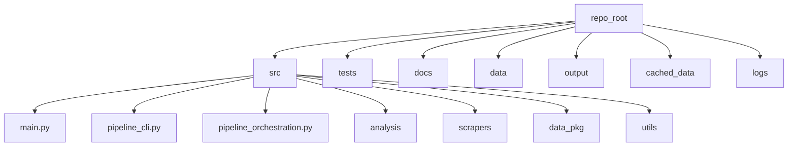
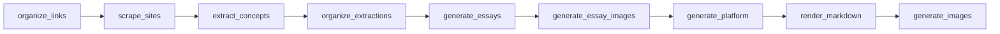
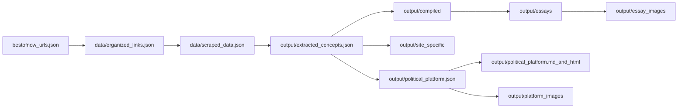
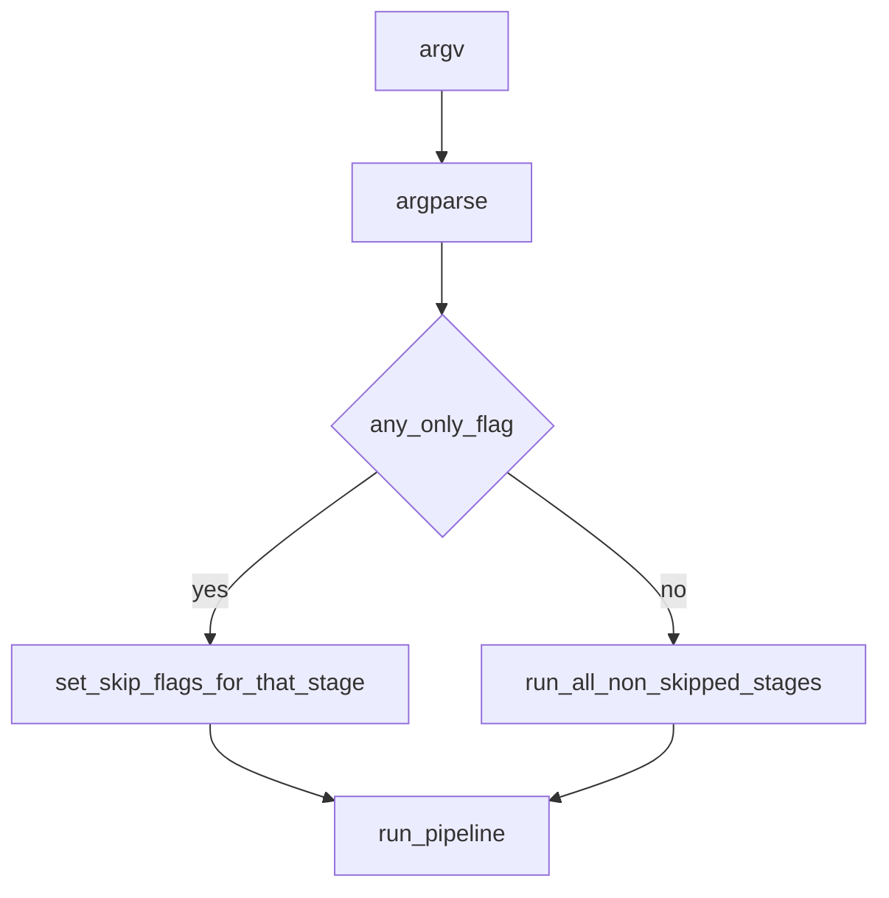

# Links Analysis — diagrams

## Repository layout

```mermaid
flowchart TB
  root[repo_root]
  root --> src[src]
  root --> tests[tests]
  root --> docs[docs]
  root --> data[data]
  root --> output[output]
  root --> cached[cached_data]
  root --> logs[logs]
  src --> main_py[main.py]
  src --> pipe_cli[pipeline_cli.py]
  src --> pipe_orch[pipeline_orchestration.py]
  src --> analysis[analysis]
  src --> scrapers[scrapers]
  src --> data_mod[data_pkg]
  src --> utils[utils]
```

## Nine-stage pipeline

```mermaid
flowchart LR
  s1[organize_links] --> s2[scrape_sites]
  s2 --> s3[extract_concepts]
  s3 --> s4[organize_extractions]
  s4 --> s5[generate_essays]
  s5 --> s6[generate_essay_images]
  s6 --> s7[generate_platform]
  s7 --> s8[render_markdown]
  s8 --> s9[generate_images]
```

## Data flow (artifacts)

```mermaid
flowchart LR
  urls[bestofnow_urls.json] --> org[data/organized_links.json]
  org --> scraped[data/scraped_data.json]
  scraped --> ext[output/extracted_concepts.json]
  ext --> compiled[output/compiled]
  ext --> site[output/site_specific]
  compiled --> essays[output/essays]
  essays --> eimg[output/essay_images]
  ext --> plat[output/political_platform.json]
  plat --> mdhtml[output/political_platform.md_and_html]
  plat --> pimg[output/platform_images]
```

## CLI

```mermaid
flowchart TD
  argv[argv] --> parse[argparse]
  parse --> only{any_only_flag}
  only -->|yes| setSkips[set_skip_flags_for_that_stage]
  only -->|no| runAll[run_all_non_skipped_stages]
  setSkips --> runPipeline[run_pipeline]
  runAll --> runPipeline
```
